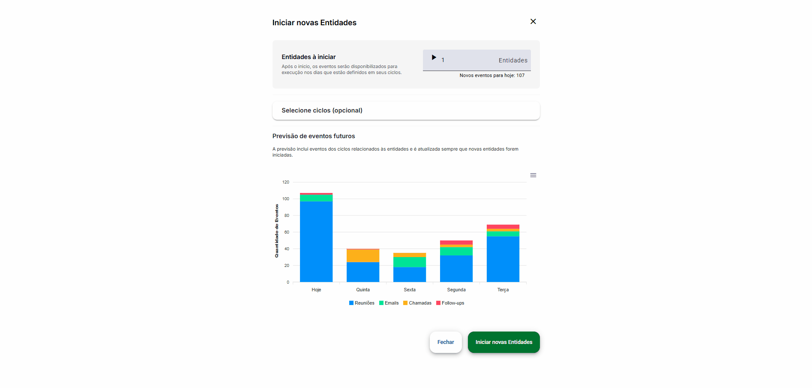

# ProjecaoDeEventos

Este projeto foi desenvolvido utilizando o [Angular CLI](https://github.com/angular/angular-cli) versão 19.2.3.

## Demonstração

Abaixo, um GIF demonstrando a usabilidade da tela principal do sistema:



> **Nota:** O GIF acima está localizado em `docs/demo.gif`. Substitua pelo seu próprio GIF de demonstração conforme necessário.

---

## Instruções para Execução

### 1. Pré-requisitos

- [Node.js](https://nodejs.org/) (versão 18.x ou superior recomendada)
- [Angular CLI](https://angular.dev/tools/cli) instalado globalmente:
  ```sh
  npm install -g @angular/cli
  ```

### 2. Instalação das Dependências

No diretório raiz do projeto, execute:

```sh
npm install
```

### 3. Executando o Servidor de Desenvolvimento

Para iniciar o servidor local, utilize:

```sh
ng serve
```

Acesse [http://localhost:4200/](http://localhost:4200/) no navegador. O aplicativo será recarregado automaticamente a cada alteração nos arquivos fonte.

### 4. Rodando os Testes Unitários

Para executar os testes unitários, utilize:

```sh
ng test
```

### 5. Rodando os Testes de Integração (E2E)

Para executar os testes end-to-end:

```sh
ng e2e
```

---

## Documentação Técnica

### Estrutura do Projeto

- `src/app/core`: Serviços e módulos centrais compartilhados.
- `src/app/features`: Funcionalidades principais, incluindo projeção de eventos.
- `src/app/shared`: Componentes, pipes e diretivas reutilizáveis.
- `src/assets`: Recursos estáticos e dados de exemplo.
- `src/styles`: Estilos globais e variáveis SCSS.

### Decisões Técnicas

- **Angular**: Framework robusto para aplicações SPA, com excelente suporte a escalabilidade e modularização.
- **Material Angular**: Utilizado para componentes visuais modernos, responsivos e acessíveis.
- **ApexCharts**: Biblioteca de gráficos utilizada para visualização de dados de eventos.
- **SCSS**: Permite organização avançada dos estilos, uso de variáveis e mixins.
- **Jest** (caso esteja configurado): Para testes unitários rápidos e confiáveis.
- **Estrutura Modular**: Separação clara entre core, features e shared para facilitar manutenção e escalabilidade.

### Motivação para Uso de Bibliotecas

- **Material Angular**: Facilita a criação de interfaces consistentes e responsivas, reduzindo o tempo de desenvolvimento de componentes visuais.
- **ApexCharts**: Escolhida por sua facilidade de integração com Angular, ampla variedade de tipos de gráficos, personalização avançada e ótima performance para dashboards interativos. Permite exibir informações de eventos de forma clara e visualmente atrativa, melhorando a experiência do usuário.
- **Jest**: Proporciona testes rápidos, snapshots e integração fácil com CI/CD.
- **SCSS**: Permite reaproveitamento de estilos e melhor organização do CSS.

### Possíveis Melhorias Futuras

- Implementação de autenticação e autorização.
- Internacionalização (i18n) para suporte a múltiplos idiomas.
- Integração com APIs externas para dados dinâmicos.
- Testes E2E mais abrangentes utilizando Cypress.
- Otimização de performance e lazy loading de módulos.
- Melhoria na acessibilidade (a11y) das interfaces.
- Adição de novos tipos de gráficos e filtros dinâmicos utilizando ApexCharts.

---

## Recursos Adicionais

- [Documentação Angular CLI](https://angular.dev/tools/cli)
- [Material Angular](https://material.angular.io/)
- [ApexCharts](https://apexcharts.com/docs/angular-charts/)
- [Jest](https://jestjs.io/)

---

> Para dúvidas ou sugestões, abra uma issue neste repositório.